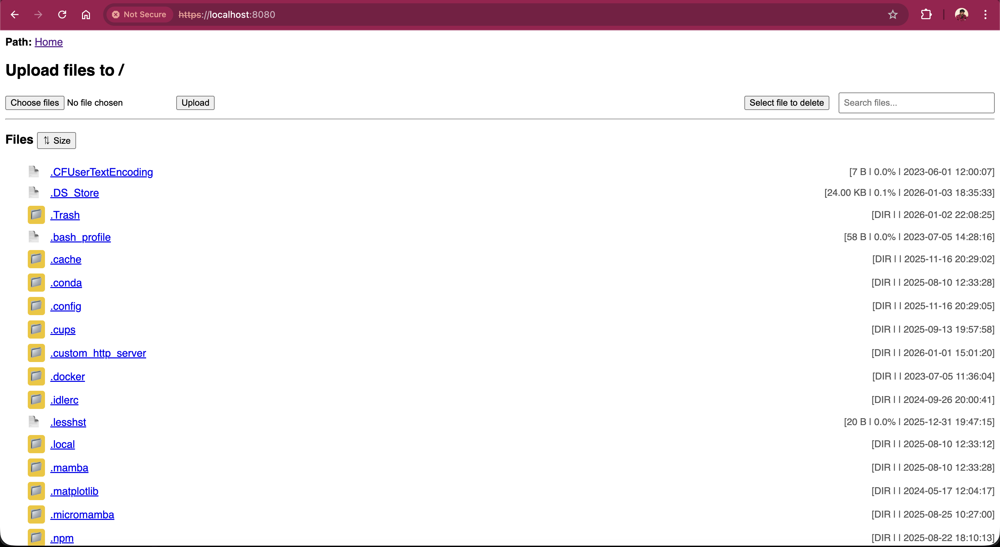

# Custom HTTPS Server


[](https://github.com/kumarmuthu/custom-https-server/actions/workflows/python-app.yml)


A lightweight, Python-based **Custom HTTP/HTTPS Server** designed to run as a **Linux systemd service** or a **macOS `launchd` agent**. It is ideal for securely serving static files, logs, test results, build artifacts, or
internal documentation.

This version includes:

* Native **HTTPS support** using a configurable SSL certificate and key
* Optional **HTTP → HTTPS redirection**
* Dynamic configuration loading from `/usr/local/etc/custom-https-server.conf` with local fallback
* Automatic creation and management of log files in the user’s home directory
* OS-specific defaults optimized for **Linux** and **macOS**
* Threaded **HTTP and HTTPS** servers with optional authentication support
* **Read and Write access modes** to control UI and file operations:

    * **Read mode**

        * No upload or delete buttons
        * No file-selection checkboxes
        * No JavaScript errors
        * Breadcrumb navigation, search, and sorting fully functional

    * **Write mode**

        * Full interactive web UI enabled
        * File upload, delete, progress indicator, and select-all supported
        * Clean separation of HTML and JavaScript logic

---

## ✅ Features

* **Pure Python 3** — no external dependencies
* Serves any local directory
* MIME-type aware (`.log`, `.tap`, `.xml`, `.html`, `.pdf`, `.md`, etc.)
* Works as:

    * **systemd service** on Linux
    * **launchd agent** on macOS
* Supports both **HTTP and HTTPS** simultaneously
* Optional HTTP → HTTPS redirection
* Reads config dynamically
* Auto-creates logs if missing
* Configurable via `.conf` file or CLI arguments
* Threaded server for concurrent requests
* Interactive terminal output is preserved

---

## Directory Structure

```
custom-https-server/
├── custom-https-server/
│   ├── custom-https-server.service       # systemd unit file (Linux)
│   ├── custom_https_server.py            # Main HTTP/HTTPS server script
│   ├── default-config.conf               # Default configuration (path/port/SSL)
│   ├── install.sh                        # Installer script (Linux & macOS)
│   ├── macos-launchd-setup.sh            # macOS launchd agent setup
│   ├── uninstall.sh                      # Uninstaller script
│   └── update-service.sh                 # Update macOS plist / Linux systemd runtime args
├── .ignore                               # Ignore file
├── HTTPS_Server.jpeg                     # Screenshot / demo image
├── LICENSE                               # MIT License
└── README.md                             # Project documentation
```

---

## 🐧 Linux Installation (Systemd Service)

```bash
git clone https://github.com/kumarmuthu/custom-https-server.git
cd custom-https-server/custom-https-server
chmod +x install.sh uninstall.sh update-service.sh
sudo ./install.sh

# Install with virtualenv
sudo ./install.sh -venv true

# OR install using system python
sudo ./install.sh -venv false
```

### Install with custom path and port

```bash
sudo ./install.sh -path /root -port 8080
```

> 🛡️ **Note:** `sudo` is required for system paths like `/opt` or `/usr/local`.

---

### 🔧 Configure Port, Directory, and SSL

Edit the config file:

Linux:
```bash
sudo vi /etc/custom-https-server.conf
```

Mac:
```bash
sudo vi /usr/local/etc/custom-https-server.conf
```

## ✅ Configuration File Check (`custom-https-server.conf`)

```ini
# -------------------------------
# Generic server
# -------------------------------
SERVE_PATH=/root
SERVE_PORT=8080
MODE=read

# -------------------------------
# OS-specific overrides (optional)
# -------------------------------
LINUX_SERVE_PATH=/var/www
MAC_SERVE_PATH=/Users/Shared

# -------------------------------
# Auth
# -------------------------------
AUTH_USERNAME=admin
AUTH_PASSWORD=password

# -------------------------------
# Logs
# -------------------------------
CFG_LOG_DIR=dynamic_path
CFG_LOG_FILE=dynamic_log_file
CFG_ERR_FILE=dynamic_err_file
```

### How this config is interpreted

* `SERVE_PATH`
  → Default serve directory
  → Overridden by `LINUX_SERVE_PATH` or `MAC_SERVE_PATH` automatically based on OS

* `SERVE_PORT`
  → Primary HTTP port
  → Used **only via config** when running as a service

* `MODE=read | write`
  → Controls UI capabilities (explained below)

* `CFG_LOG_*`
  → Resolved dynamically at runtime
  → Logs are auto-created if paths don’t exist

> Logs are auto-created if missing (`LOG_DIR`, `LOG_FILE`, `ERR_FILE`) and **stdout/stderr are displayed in terminal**
> when running interactively.

---

Restart to apply changes:

```bash
sudo systemctl restart custom-https-server
```

---

### ✅ Verify

```bash
sudo systemctl status custom-https-server
sudo lsof -i :80    # Or your configured HTTP port
sudo lsof -i :443   # Or your configured HTTPS port
```

---

### 📜 Logs

The server **auto-creates logs** in the user directory (`LOG_DIR`) if missing. Example:

```bash
tail -f /Users/<username>/custom_https_server_log/logs/custom_https_server.log
tail -f /Users/<username>/custom_https_server_log/logs/custom_https_server.err
```

> Replace `<username>` with your actual user.

---

### 🔓 Allow Port in Firewall

#### Rocky Linux

```bash
sudo firewall-cmd --permanent --add-port=80/tcp
sudo firewall-cmd --permanent --add-port=443/tcp
sudo firewall-cmd --reload
```

#### Ubuntu

```bash
sudo ufw allow 80/tcp
sudo ufw allow 443/tcp
sudo ufw reload
```

---

### ❌ Uninstall (Linux)

```bash
cd custom-https-server/custom-https-server
sudo ./uninstall.sh
```

---

---

## 🍏 macOS Installation (launchd Agent)

```bash
git clone https://github.com/kumarmuthu/custom-https-server.git
cd custom-https-server/custom-https-server
chmod +x install.sh uninstall.sh macos-launchd-setup.sh update-service.sh
```

Install with:

```bash
sudo ./install.sh -path /Users/<username> -port 8080
```

* `-path` → Directory to serve
* `-port` → HTTP/HTTPS port

The installer automatically sets up a `launchd` agent.

---

### ✅ Verify & Logs (macOS)

Check if service is running:

```bash
launchctl list | grep custom_https_server
```

Validate plist syntax (optional):

```bash
plutil ~/Library/LaunchAgents/com.custom_https_server.plist
```

Watch logs in real time:

```bash
tail -f /Users/<username>/custom_https_server_log/logs/custom_https_server.log
tail -f /Users/<username>/custom_https_server_log/logs/custom_https_server.err
```

> Replace `<username>` with your actual macOS username.

---

### ❌ Uninstall (macOS)

**Automated:**

```bash
cd custom-https-server/custom-https-server
sudo ./uninstall.sh
```

**Manual:**

```bash
launchctl unload ~/Library/LaunchAgents/com.custom_https_server.plist
rm -f ~/Library/LaunchAgents/com.custom_https_server.plist
launchctl list | grep custom_https_server
```

---

---

## ✅ CLI Usage (Standalone / Development Mode)

```bash
python3 custom_https_server.py \
    --path /Users/muthukumar \
    --bind 0.0.0.0 \
    --mode read \
    --user admin \
    --pass password
```

### Behavior in CLI mode

* **Ports are automatically loaded from the configuration file**
* If no config file exists, **internal defaults are used**
* CLI arguments **override config values only when explicitly provided**
* Intended for:

    * Development
    * Debugging
    * Temporary/manual runs
* **Not used by systemd or launchd**

---

## ⚙️ Configuration & Port Handling (Important)

> **Important:**
> When running as a **systemd service (Linux)** or a **launchd agent (macOS)**, the server is started **without any CLI
arguments**.

In service mode:

* No `--port`, `--path`, or other CLI flags are passed
* All runtime settings are loaded dynamically from:

  ```
  /usr/local/etc/custom-https-server.conf or /etc/custom-https-server.conf
  ```
* This includes:

    * HTTP / HTTPS ports
    * Serve path (with OS overrides)
    * Authentication credentials
    * SSL certificate and key (if enabled)
    * `read` / `write` mode

👉 **CLI arguments are ignored in service mode by design**

👉 They exist **only for standalone or development usage**

---

## 🔐 Server Modes: `read` vs `write`

The server supports **two operating modes** that control **UI behavior and filesystem access**.
You can configure the mode **during installation**, **via config file**, or **at runtime using CLI arguments**.

---

### 📘 READ Mode (Safe / View-Only)

`MODE=read`

This is the **default and recommended mode** for logs, reports, artifacts, and internal documentation.

**Behavior:**

* ❌ No upload buttons
* ❌ No delete buttons
* ❌ No file selection checkboxes
* ❌ No JavaScript console errors
* ✅ Clean, static browsing UI
* ✅ Breadcrumb navigation works
* ✅ File search works
* ✅ Sorting by name / size / date works
* ✅ Read-only access to files and directories

**Use cases:**

* Test results
* Logs
* Build artifacts
* Documentation servers
* CI/CD output sharing
* Audit-safe environments

**Example config:**

```ini
MODE=read
```

**CLI example:**

```bash
python3 custom_https_server.py --mode read
```

---

### ✍️ WRITE Mode (Full File Management UI)

`MODE=write`

Enables the **full interactive UI** with filesystem modification support.

**Behavior:**

* ✅ Upload files (with progress)
* ✅ Delete files and directories
* ✅ Select-all / multi-select support
* ✅ Clean separation of HTML + JavaScript
* ✅ No inline JS hacks
* ✅ Full UI controls enabled
* ⚠️ Filesystem is writable — use with care

**UI Features Enabled:**

* Upload button
* Delete button
* Progress bar
* File checkboxes
* Bulk operations

**Use cases:**

* Temporary file drops
* Internal file sharing
* Controlled admin environments
* Dev / test systems

**Example config:**

```ini
MODE=write
```

**CLI example:**

```bash
python3 custom_https_server.py --mode write
```

---

### ⚠️ Security Recommendation

* Use **`read` mode** for:

    * Production
    * CI systems
    * Public or semi-public access
* Use **`write` mode** only when:

    * Authentication is enabled
    * Access is restricted
    * You trust all users

> The server intentionally keeps **read mode completely free of write-related UI elements and JS**, ensuring a clean,
> stable browsing experience.

---

## 🔄 Changing Mode After Installation

The server mode (`read` / `write`) is controlled **only via the config file**.
After changing the config, **always reload using `update-service.sh`**.

---

## 🐧 Linux (systemd)

### 1️⃣ Edit config

```bash
sudo vi /etc/custom-https-server.conf
```

Change:

```ini
MODE=read   # or write
```

### 2️⃣ Apply changes (recommended)

```bash
sudo ./update-service.sh
```

✅ What this does internally:

* Stops the systemd service
* Waits for the port to be released
* Force-kills stale processes if needed
* Updates `ExecStart`
* Reloads systemd
* Restarts the service cleanly

> ⚠️ **Do NOT use `systemctl restart` directly** after config changes —
> it may fail if the port is still in use.

---

## 🍏 macOS (launchd)

### 1️⃣ Edit config

```bash
sudo vi /usr/local/etc/custom-https-server.conf
```

Change:

```ini
MODE=read   # or write
```

### 2️⃣ Apply changes (required on modern macOS)

```bash
sudo ./update-service.sh
```

✅ What this does internally:

* Updates `ProgramArguments` in the plist
* Disables `KeepAlive` temporarily
* Properly `bootout`s the LaunchAgent
* Kills lingering processes (user/root)
* Waits for the port to fully free
* Re-enables `KeepAlive`
* `bootstrap`s the agent **as the original GUI user**

---

## ❌ Deprecated / NOT Recommended

### macOS (old method)

```bash
launchctl unload ~/Library/LaunchAgents/com.custom_https_server.plist
launchctl load ~/Library/LaunchAgents/com.custom_https_server.plist
```

🚫 Problems:

* Breaks when run as root
* Fails on Ventura+
* Leaves zombie processes
* Port conflict issues

---

## ✅ Final Recommendation (Both OS)

**Always use this after changing config:**

```bash
sudo ./update-service.sh
```

This guarantees:

* No port conflicts
* No zombie processes
* Correct user context
* Safe restart on both macOS & Linux

---

### ✅ Summary

| Mode  | UI      | Upload | Delete | Safe for Prod |
|-------|---------|--------|--------|---------------|
| read  | Minimal | ❌      | ❌      | ✅             |
| write | Full UI | ✅      | ✅      | ⚠️            |

---

### 📸 Screenshots

The following image gives you a glimpse of the application's interface:

- **HTTPS Web Page**: 

---

## License

MIT License — free to use, modify, and distribute.

---

## Author

Developed and maintained by **Muthukumar S**
GitHub: [https://github.com/kumarmuthu](https://github.com/kumarmuthu)

---
